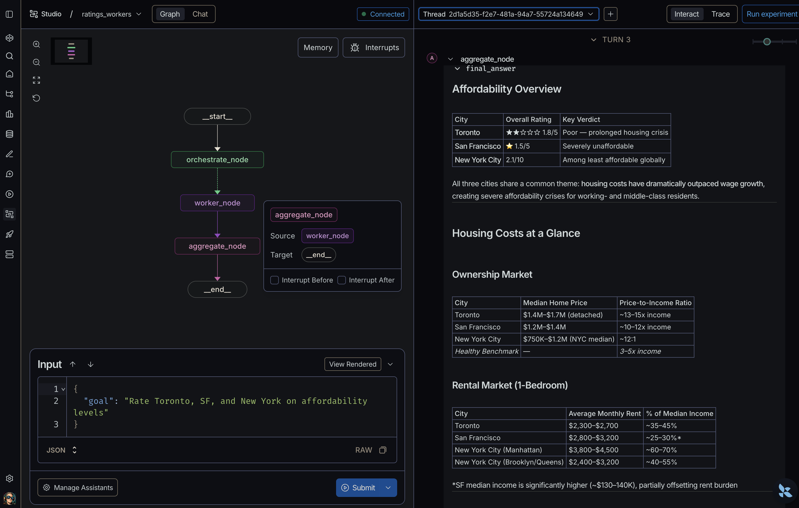
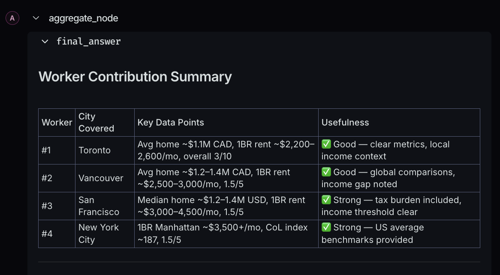

# Orchestrator-Worker

> A central orchestrator decomposes a goal into independent sub-tasks, fans them out to worker agents in parallel, collects their results, and synthesizes a final answer.

The orchestrator-worker pattern maps directly to Kafka's partitioned topic model:
- the orchestrator publishes one task per partition, worker agents consume from their assigned partition, and results flow back on a response topic. In the implementations here, asyncio queues stand in for Kafka — swapping transports requires no changes to agent logic.

Two implementations are provided:

| File | Description |
|------|-------------|
| [`orchestrator_worker.py`](orchestrator_worker.py) | LangChain skeleton with `StreamingPlatform` abstraction (asyncio queues), `Orchestrator`, and `WorkerAgent` classes |
| [`orchestrator_worker_langgraph.py`](orchestrator_worker_langgraph.py) | Pure LangGraph `StateGraph` version — fan-out via `Send()`, fan-in via `operator.add` reducer, no message broker |

**CLI version** — Accpeting a document payload, the example runs a credit risk analysis of a fictional company, Acme Precision Parts Inc. The financial data (income statement, balance sheet, cash flows, debt schedule, and peer comparisons) is provided as a document payload in [`payload.md`](payload.md).

**LangGraph Studio version** ([`studio/`](studio/)) — a general-purpose version that takes any goal as free-text input and does not require a document payload. The number of workers is not fixed — the orchestrator analyzes the goal and determines how many sub-tasks are needed (e.g. a goal comparing 4 cities produces 4 workers).

In the Studio input panel, provide the initial state as JSON:

```json
{"goal": "Rate Toronto, Vancouver, SF, and NYC on affordability levels"}
```

Set `show_provenance` to `true` to include a worker attribution table in the final answer, showing each worker's contribution before the synthesis:

```json
{"goal": "Rate Toronto, Vancouver, SF, and NYC on affordability levels", "show_provenance": true}
```





See [`orchestrator_worker.md`](orchestrator_worker.md)
and [`orchestrator_worker_langgraph.md`](orchestrator_worker_langgraph.md)
for detailed architecture notes.

> **Disclaimer:** The credit risk analysis produced by this demo is generated entirely by an LLM and is provided for illustrative purposes only. Outputs may vary, contain errors, or reflect model hallucinations. This is not financial or investment advice. Any production-ready credit risk system would require validated models, human oversight, regulatory compliance, and rigorous backtesting before use in real decision-making.

## Quick start

```bash
cd orchestrator-worker
cp .env.example .env          # add your ANTHROPIC_API_KEY
python -m venv .venv
source .venv/bin/activate
pip install -r requirements.txt

# LangChain version (with asyncio queue)
python orchestrator_worker.py

# LangGraph version (with langgraph shared state)
python orchestrator_worker_langgraph.py

# Show worker attribution table)
python orchestrator_worker_langgraph.py --provenance

# LangGraph Studio 
cd studio
langgraph dev
```


