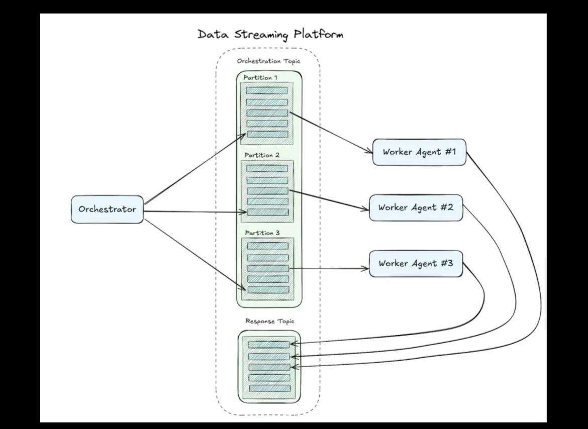

# Orchestrator-Worker

The diagram shows:
1.  Orchestrator → fans out tasks to N partitions in an ...
2.  Orchestration Topic → each partition consumed by a ...
3.  Worker Agent → Workers write results back to a ...
4.  Response Topic → Orchestrator reads responses.

Here's the skeleton, mapped precisely to that architecture:Skeleton maps directly to the diagram's five moving parts:

**`StreamingPlatform`** — the dashed-box "Data Streaming Platform". Right now it's asyncio queues; swap `publish_task` / `consume_partition` / `publish_result` / `consume_response` for actual Kafka producers/consumers (confluent-kafka, aiokafka) with zero changes to the agent logic.

**`Task` / `TaskResult`** — the "messages in a partition" (the hatched rectangles). `Task` goes into the Orchestration Topic; `TaskResult` comes back on the Response Topic.

**`Orchestrator`** — two chains: a decompose chain that breaks the goal into N sub-tasks (one per partition), and an aggregate chain that synthesizes all worker results into a final answer.

**`WorkerAgent`** — one per partition. Polls its assigned partition via `consume_partition`, runs its LLM chain, writes `TaskResult` to the Response Topic. Maintains optional per-worker conversation history.

**`main()`** — wires it all: creates the platform, spawns 3 worker `asyncio.Task`s in the background, calls `orchestrator.run()`, then `gather`s.

**TODO:**
- [x] Scale partitions: change `NUM_PARTITIONS` — workers and fan-out follow automatically
- [ ] Add tool-calling: give `WorkerAgent._chain` a `bind_tools(...)` call
- [ ] Swap transport: replace the `asyncio.Queue` internals in `StreamingPlatform` with aiokafka `AIOKafkaProducer` / `AIOKafkaConsumer`
- [x] Add a `LangGraph` state machine on top of `Orchestrator` 
  - [ ]  Add checkpointing and retry logic
